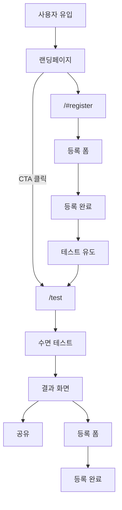

# Sleep Thera 랜딩페이지 - 전체 구조

> **라이팅 가이드**: 문서 내 문구는 의미 전달용 예시입니다. 실제 카피는 디자이너/기획자가 수정 가능합니다.

> **프로젝트 배경**: [BACKGROUND.md](./BACKGROUND.md) 참조
> **페이지별 상세**: [pages/](./pages/) 폴더 참조

---

## 와이어프레임

> 📁 원본: `docs/wireframes/Wireframe.pen`
> 📁 이미지: `docs/wireframes/original/` (원본) / `docs/wireframes/labeled/` (라벨)

| 페이지 | 프레임 |
|--------|--------|
| 랜딩페이지 | Landing Page - Desktop (1440px) |
| 테스트 | Test - Intro, Test - Question, Test - ISI Question, Test - Result (800px) |
| 등록 | Register - Form, Register - Success + Test Part 1 (800px) |

**라벨 이미지 생성**: `node scripts/label-wireframes.js`

---

## 1. 사이트맵

| 경로 | 페이지 | 상세 |
|------|--------|------|
| `/` | 랜딩페이지 | [pages/landing.md](./pages/landing.md) |
| `/test` | 수면 테스트 | [pages/test.md](./pages/test.md) |
| `/test/result` | 결과 공유 | [pages/test.md](./pages/test.md) |
| `/register` | 등록 페이지 | [pages/register.md](./pages/register.md) |
| `/privacy` | 개인정보처리방침 | - |
| `/terms` | 이용약관 | - |

---

## 2. 전체 사용자 플로우

---

## 3. 수집 데이터

### 등록 데이터 (필수)
| 항목 | 설명 |
|------|------|
| 이메일 | 중복 허용 |
| 휴대폰번호 | 선택 |
| 개인정보 수집 동의 | 필수 |

### 테스트 데이터 (테스트 완료 시)

#### 필수 수집 (모든 사용자)
| 항목 | 설명 |
|------|------|
| 수면 고민 | 복수 선택 ("크게 고민 없음" 포함) |
| ISI 점수/등급 | 0~28점, normal/mild/moderate/severe |

#### 조건부 수집 (해당 시)
| 항목 | 조건 | 설명 |
|------|------|------|
| 입면 소요 시간 | Q1 ≥ 1점 | 직접 입력 (최대 12시간) |
| 중간 각성 시간 | Q2 ≥ 1점 | 직접 입력 (최대 12시간) |
| 총 실 수면 시간 | Q3 ≥ 1점 | 직접 입력 (최대 24시간, 순수 수면) |

#### ISI 8점+ 사용자 추가 수집
| 항목 | 설명 |
|------|------|
| 수면 문제 시작 시기 | 3개월 이하 ~ 10년 이상 |
| 수면제 복용 경험 | 예/아니오 |
| 부작용 경험 | 복수 선택 (수면제 "예" 시) |
| 성별 | 남성/여성/기타 |
| 연령대 | 10대 이하~70대 이상 |

### 자동 수집
| 항목 | 설명 |
|------|------|
| 유입 경로 | landing / test |
| UTM 파라미터 | source, medium, campaign |

### 데이터 보존 요구사항

- 테스트 중 이탈해도 응답 데이터 보존
- 테스트 완료 후 등록 시 테스트 데이터와 연결
- 등록하지 않은 테스트 완료자 데이터도 보존

---

## 4. SEO 요구사항

### 페이지별 메타 태그

| 페이지 | title | description |
|--------|-------|-------------|
| `/` | Sleep Thera \| 뇌과학 기반 불면증 디지털 치료제 | 수면제 부작용 없이 불면증을 치료하는 CE 인증 디지털 치료제 |
| `/test` | 수면 테스트 \| 내 불면증은 얼마나 심각할까? | 30초 만에 확인하는 불면증 심각도 테스트 |
| `/test/result` | 내 불면증 심각도: {score}점 (동적) | 점수별 메시지 (동적) |
| `/register` | 사용 신청 \| Sleep Thera | 20만원 상당의 4주 수면 테라피를 무료로 체험하세요 |

### OG 이미지
- 각 페이지별 OG 이미지 필요
- `/test/result`는 점수/등급이 표시되는 동적 OG 이미지

### 기술적 SEO
- sitemap.xml, robots.txt 생성
- 모든 이미지에 alt 속성
- 페이지당 H1 태그 1개

### Schema.org 구조화 데이터
| 페이지 | 스키마 타입 | 용도 |
|--------|------------|------|
| `/` | FAQPage | FAQ 섹션 마크업 (검색 결과에 FAQ 노출) |
| `/` | Organization | 회사 정보 (신뢰도 향상) |
| `/` | MedicalWebPage | 의료 관련 콘텐츠 명시 |

> FAQ Schema는 AI 검색(GEO)에서도 답변 소스로 인용될 가능성 높임

---

## 5. Analytics 요구사항

### 추적할 이벤트

| 이벤트 | 시점 | 포함 데이터 |
|--------|------|------------|
| 테스트 시작 | 테스트 시작 버튼 클릭 | - |
| 테스트 진행 | 각 파트 완료 시 | part_number (1~5) |
| 테스트 완료 | Result Screen 도달 | 점수, 등급 |
| 등록 시작 | 등록 폼 진입 | 테스트 완료 여부 |
| 등록 완료 | 등록 성공 | ISI 점수, 부작용 여부 |
| 결과 공유 | 링크 복사 버튼 클릭 | - |

### 이탈 추적

| 이벤트 | 시점 | 포함 데이터 |
|--------|------|------------|
| 등록 이탈 | 폼 진입 후 페이지 떠남 | 마지막 입력 필드 |
| 테스트 이탈 | 테스트 중 페이지 떠남 | 마지막 문항 번호, 파트 |
| 랜딩 이탈 | 랜딩페이지에서 떠남 | 마지막 스크롤 위치 (섹션명) |

### 확인 가능해야 할 지표

| 지표 | 설명 |
|------|------|
| 일일 방문자 수 | - |
| 유입 경로별 방문자 | UTM 파라미터 기반 |
| Referral 트래픽 비율 | 공유 링크 통한 유입 비율 |
| 퍼널 전환율 | 랜딩 → 테스트 → 등록 각 단계별 |
| ISI 15점+ 등록자 비율 | 타겟 유저 적합도 |
| 부작용 경험자 비율 | 등록자 중 수면제 부작용 "예" 비율 |

---

## 6. 기술 요구사항

| 항목 | 내용 |
|------|------|
| 도메인 | `sleep.belltherapeutics.net` |
| 페이지 로딩 속도 | Core Web Vitals 기준 충족 (LCP 2.5s 이하) |
| 반응형 Breakpoint | 768px 미만: 모바일 / 768px 이상: 데스크톱 |

---

## 7. 보안 요구사항

| 항목 | 내용 |
|------|------|
| HTTPS | 모든 페이지와 API는 HTTPS 필수. HTTP 요청은 HTTPS로 리다이렉트 |
| 입력값 검증 | 클라이언트/서버 양쪽에서 이메일, 전화번호 형식 검증. XSS 방지를 위한 이스케이프 처리 |
| 개인정보 암호화 | 이메일, 휴대폰번호는 DB에 암호화 저장 |
| Rate Limiting | 등록 API에 동일 IP 요청 제한 적용 |
| CORS | 허용된 도메인에서만 API 호출 가능 |
| 세션 ID | 추측 불가능한 랜덤 값 사용 (테스트-등록 데이터 연결용) |

---

## 8. 기능 요구사항

> 페이지별 상세 명세 참조. 여기서는 ID 요약만 제공.

### 랜딩페이지 ([landing.md](./pages/landing.md))

| ID | 기능 |
|--------|------|
| LAND-001 | 고정 헤더 + CTA 버튼 |
| LAND-002 | 메인 비주얼 + 핵심 메시지 + CTA |
| LAND-003 | 인증 및 파트너십 신뢰 요소 표시 |
| LAND-004 | 타겟 유저 공감 유도 + 통계 기반 문제 제기 |
| LAND-005 | Sleep Thera 차별점 제시 |
| LAND-006 | 작동 원리 시각화 |
| LAND-007 | 사용자 후기 캐러셀 |
| LAND-008 | 연구 협력 신뢰 요소 |
| LAND-009 | 등록 폼 + 테스트 연결 |
| LAND-010 | 자주 묻는 질문 아코디언 |
| LAND-011 | 회사 정보 + 법적 링크 |

### 테스트 ([test.md](./pages/test.md))

| ID | 기능 |
|--------|------|
| TEST-001 | 테스트 전용 헤더 (CTA 숨김) |
| TEST-002 | 테스트 시작 화면 (플로우 B에서만 표시) |
| TEST-003 | 문항 진행 UI |
| TEST-004 | 수면 고민 복수 선택 |
| TEST-005 | ISI 7문항 + 조건부 후속 질문 |
| TEST-006 | ISI 8점 이상 사용자 대상 추가 질문 |
| TEST-007 | ISI 점수 계산 및 등급 분류 |
| TEST-008 | 테스트 결과 표시 + 등록 유도 |
| TEST-009 | 결과 링크 복사 + 동적 OG 이미지 |
| TEST-010 | 테스트 응답 저장 + 등록 시 연결 |

### 등록 ([register.md](./pages/register.md))

| ID | 기능 |
|--------|------|
| REG-001 | 등록 유도 메시지 + 사회적 증거 |
| REG-002 | 연락처 수집 + 동의 |
| REG-003 | 폼 제출 및 에러 처리 |
| REG-004 | 등록 완료 후 테스트 자동 시작 (플로우 A) |
| REG-005 | Result Screen 하단 등록 폼 → 완료 메시지 전환 (플로우 B) |
| REG-006 | 테스트 완료 후 등록 시 데이터 자동 연결 |
| REG-007 | 폼 진입 후 이탈 시 마지막 입력 필드 기록 |

### 데이터 / 기술

| ID | 요구사항 |
|--------|---------|
| DATA-001 | 유입 경로와 UTM 파라미터가 수집된다 |
| DATA-002 | 테스트 데이터와 등록 데이터가 연결된다 |
| SEO-001 | 각 페이지에 메타 태그가 설정된다 |
| SEO-002 | sitemap.xml과 robots.txt가 생성된다 |
| PERF-001 | LCP가 2.5초 이하이다 |
